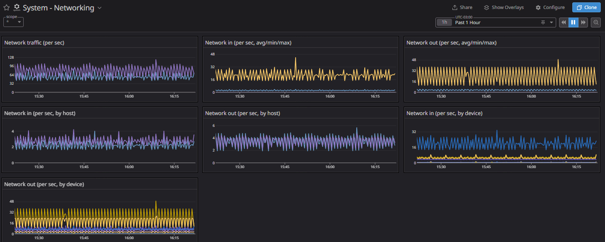

[**Volver**](../README.md)

## Checkpoint 3

Para este checkpoint se ha colocado como objetivo una serie de elementos a desarrollar presentes en el backlog de la iteracion 2 dentro del [github projects](https://github.com/orgs/ClassConnect-org/projects/1/views/2) de la organización, y además incorporar un sistema de analisis de métricas sobre los servicios.

### Cambios respecto al anterior checkpoint

1. Se cambió en el servicio de notificaciones, de smtp con gmail, a la API provista por el sistema de notificaciones [Brevo](https://www.brevo.com/). Esta decision se tomo, dado que el servicio utilizado [*LKE*](https://techdocs.akamai.com/cloud-computing/docs/getting-started-with-lke-linode-kubernetes-engine) para kubernetes, filtra paquetes con protocolo SMTP, ya que como parte de su negocio, ofrecen un servicio pago al respecto.
2. Para el guardado de archivos en la nube, se optó por usar [Supabase Storage](https://supabase.com/docs/guides/storage) en lugar de [Firebase Cloud Storage](https://firebase.google.com/products/storage?hl=es-419), ya que al tener creadas y configuradas dos bases de datos *(users y courses)* en dicha plataforma, se simplifico utilizar la misma para el uso mencionado. Por otro lado, a diferencia de supabase la plataforma firebase, cuenta con una serie de pasos previos para poder usar el servicio (e.g. activar cuenta por medio de verificacion de medio de pago).

### Backlog comprometido

El backlog comprometido se puede visualizar [aqui](https://github.com/orgs/ClassConnect-org/projects/1/views/3), este consiste en los siguientes items:

**Users:**

- Inicio de sesión con Google ✔️  
- Ver mi perfil ✔️  
- Ver perfiles de otros ✔️  
- Editar perfil ✔️  
- Almacenamiento en la nube para foto de perfil ✔️  

**Courses:**

- Obtener información detallada de cursos ✔️  
- Filtrar cursos ✔️  
- Validar datos para cursos ✔️  
- CRUD de tareas y evaluaciones ✔️  
- Inscribir estudiantes en cursos ✔️  
- Visualizar cursos ✔️  
- Configurar criterios de elegibilidad para cursos ✔️  
- Obtener cursos que contienen estudiantes ✔️  

**Mobile:**

- Crear diseño para tareas y exámenes ✔️  
- Recibir y enviar información de cursos ✔️  
- Añadir sistema de sesión de login y su persistencia ✔️  
- Hacer vistas accesibles solo por propiedad en cursos ✔️  
- Crear vista para editar perfil ✔️  
- Añadir solicitud GET funcional de vista de perfil a servicio de usuarios ✔️  
- Hacer vistas accesibles solo por propiedad en tareas ❌  
- Diseñar vistas para editar y eliminar curso ❌  

**Notifications:**

- Creación de base de datos (MongoAtlas - MongoDB) ✔️  
- Enviar notificaciones por email para eventos ✔️  
- Configuración de notificaciones de usuario ✔️  
- Registrar notificaciones (logs) ✔️  
- Enviar notificaciones push ❌  

**Administration:**

- Creación de base de datos (MongoAtlas - MongoDB) ✔️  
- Reglas (CRUD) ✔️  
- Creación e inicio de sesión de administradores ✔️  
- Registro de auditoría ❌  

**DEVOPS:**

- Métricas con Datadog ✔️  

### Almacenamiento de archivos en la nube

Se utilizó como servicio de almacenamiento de archivos en la nube a [Supabase Storage](https://supabase.com/docs/guides/storage), donde se almacenan hasta el momento las imagenes de perfil de los usuarios con un tamaño maximo de archivo de 10MB. En la siguiente iteracion, se crearan **buckets** para almacenar archivos correspondientes a tareas que crean los profesores, y entregas por parte de los alumnos (e.g. pdf, docx, txt).

### Sistema de Métricas

Se añadió un sistema de monitoreo a los microservicios utilizando la plataforma [Datadog](https://www.datadoghq.com/), desplegando por un lado un agente de datadog para el clúster de kubernetes, que proporciona informacion sobre el estado de dicho cluster, los nodos, los pods y recursos, a nivel kubernetes y no aplicacion (un ejemplo se puede ver a continuacion en una captura de uno de los dashboards al respecto). Y por otro lado un datadog node agent por cada nodo desplegado, como un daemonset, lo que permite recopilar informacion por nodo sobre el uso de cpu, memoria, banda ancha, entre otros.

Se añandió un nuevo repositorio de infraestructura como código, donde se ejecuta el *pipeline* correspondiente para cargar la integración de herramientas de monitoreo de datadog en kubernetes.

**Ejemplo de dashboards de datadog**

A continuacion se muestran capturas de algunos de los dashboards mas relevantes disponibles en la plataforma:

System metrics:

System networking: 

Kubernetes pods overview:

**Alertas**

También se agrego un sistema de monitoreo con alarmas disparadoras donde al activarse al pasar un umbral pre-definido, por ejemplo cierto porcentaje de uso de CPU en alguno de los nodos, se envía una notificación por email a cada uno de los administradores (para esto se creo un google groups, al cual en futuras iteraciones se agregaran automaticamente los nuevos administradores creados):

